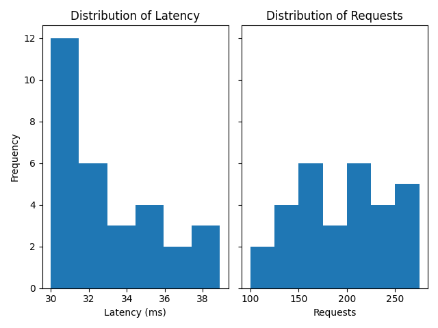
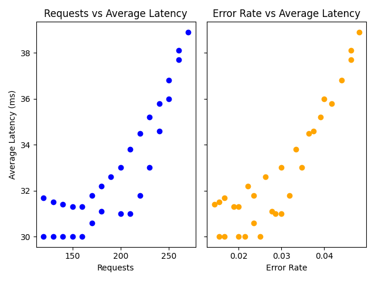

## Custom Project

### Dataset
I used web service metrics which contained number of errors, requests and total latency time. (Source: https://denisecase.github.io/pro-analytics-02/reference/datasets/cintel/#9-web-service-metrics-example-file)

### Signals
The main signals of interest were error rate, average latency time, and latency percentiles.

### Experiments
I began by adding a histogram of latency time, latency is one of the "Four Golden Signals" and the tail end represents particularly lengthy requests or errors.
I then added a econd graph showing the correlation of requests and error rate to average latency time..

### Results
Only 3 of the data rows had a latency above the 90th percentile. Of these three the error rate was on the higher side, averaging around 4.5%, the total number of requests was also high.

### Interpretation
Without detailed latency information (latency per request versus per error, for example) it's difficult to determine if errors are slow or if more requests result in greater latency.

### Figures

# Continuous Intelligence

This site provides documentation for this project.
Use the navigation to explore module-specific materials.

## How-To Guide

Many instructions are common to all our projects.

See
[⭐ **Workflow: Apply Example**](https://denisecase.github.io/pro-analytics-02/workflow-b-apply-example-project/)
to get these projects running on your machine.

## Project Documentation Pages (docs/)

- **Home** - this documentation landing page
- **Project Instructions** - instructions specific to this module
- **Your Files** - how to copy the example and create your version
- **Glossary** - project terms and concepts

## Additional Resources

- [Suggested Datasets](https://denisecase.github.io/pro-analytics-02/reference/datasets/cintel/)
